<p align="center">
  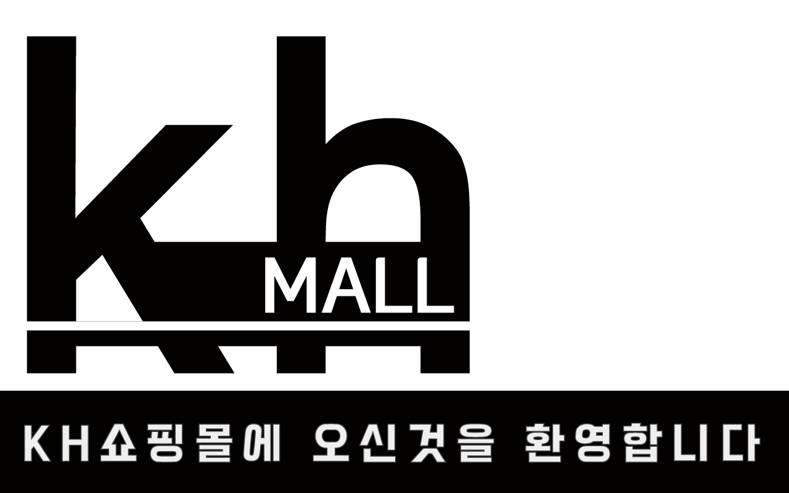
<p>


## :convenience_store: 프로젝트 소개
```
KH몰은 대중성 있는 여성의류 중심의 고감도 쇼핑몰입니다.
```


## 📅 개발 기간
```
2022.10.20 ~ 2022.11.22
```


## 🧑‍🤝‍🧑 멤버 구성


<p align="center">
  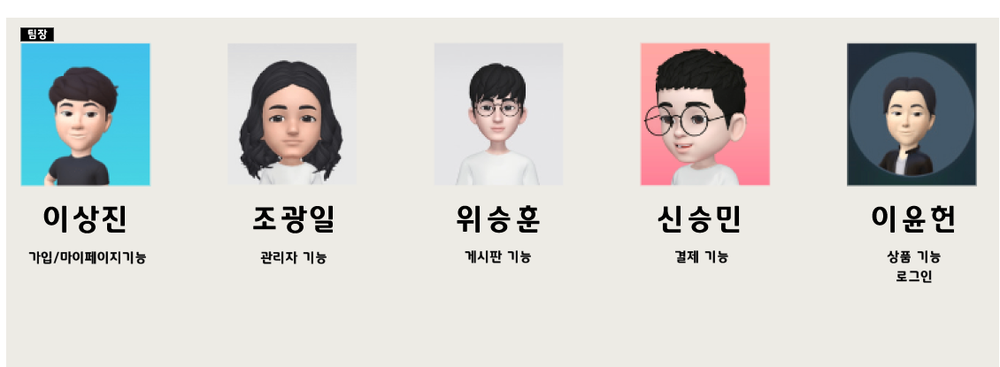
<p>


## 🧰 개발 환경 
<p align="center">
    
     
<p>

## ⚙️ 기술 스택
<p align="center">
         
  
<p>


## 🔨 주요 기능 및 상세

|기능|상세|
|:--:|:--:|
|로그인|세션을 이용하여 로그인 구현, AdminCheck(Boolean) 값을 이용해 관리자와 회원 구분 |
|회원가입| |
|마이페이지| 내 정보(수정,삭제)   |
|게시글페이지| 게시글 등록,조회,수정,삭제,댓글|
|상품페이지| 상품: 조회,평점,구매 / 리뷰:등록,수정,삭제 |
|결제페이지| 휴대폰인증, 결제|
|관리자페이지| 유저관리:  조회,삭제 / 상품관리: 등록,조회,수정,삭제 |
|검색||
|보안| XSS, sql injection, CSRF 등 공격 방지

  ### 1. 메인페이지  네비게이션바/상품노출/푸터
<p align="center">
  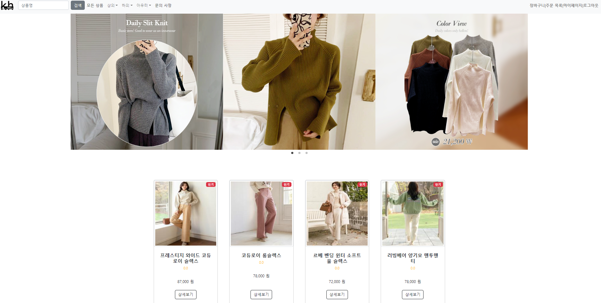
<p>
<br>

  
  
### 2. 로그인  로그인/회원가입/마이페이지/게시글페이지/상품페이지/결제/관리자
<p align="center">
  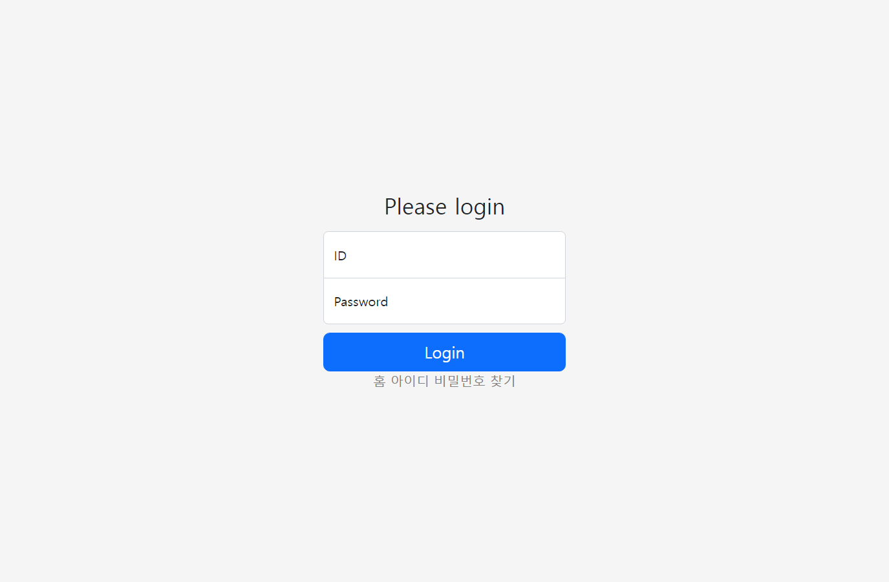
<p>
<br><br>
  

### 3. 회원가입
<p align="center">
  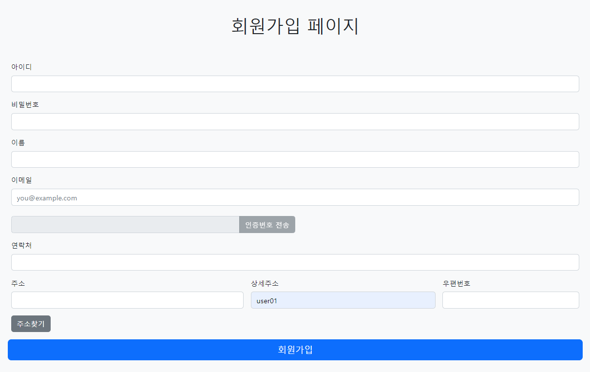
<p>
<br><br>

### 4. 마이페이지	
<p align="center">
  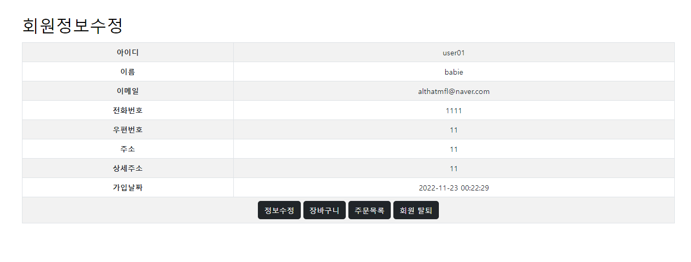
<p>
<br><br>

### 5. 게시글페이지 (등록 / 조회 / 수정 / 삭제 / 댓글)	
<p align="center">
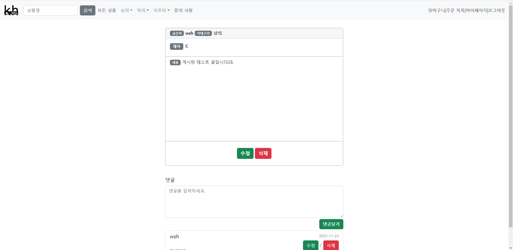
</p>
<br><br>


<p align="center">
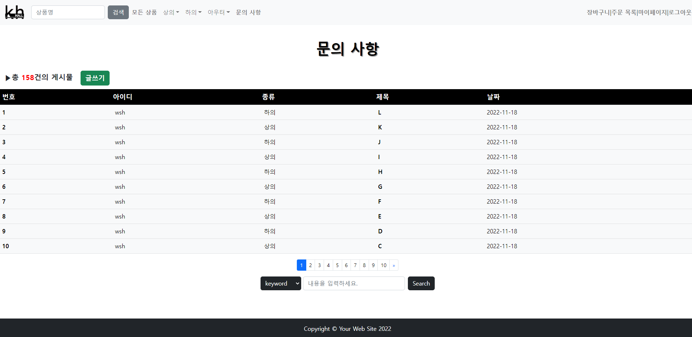
</p>
<br><br>


### 6. 상품페이지 (조회 / 평점 / 구매 / 리뷰)
<p align="center">
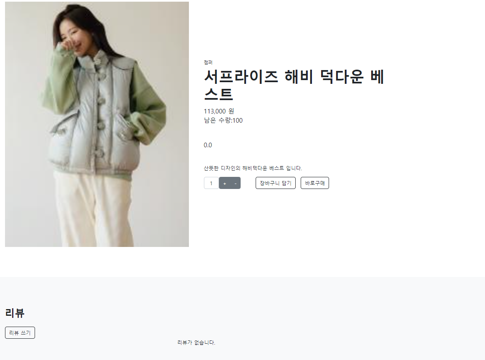
</p>
<br><br>


### 7. 결제	
<p align="center">
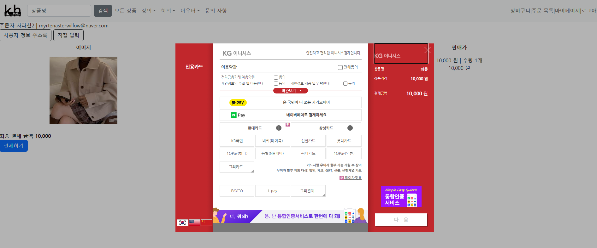
</p>
<br><br>


### 8. 관리자 (유저관리:  조회,삭제 / 상품관리: 등록,조회,수정,삭제) 	

<p align="center">
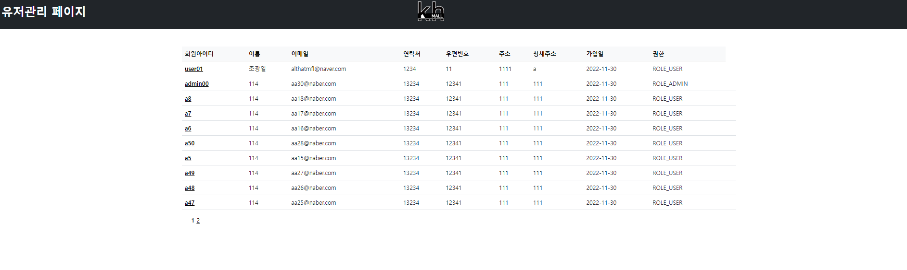
</p>
<br>
<p align="center">
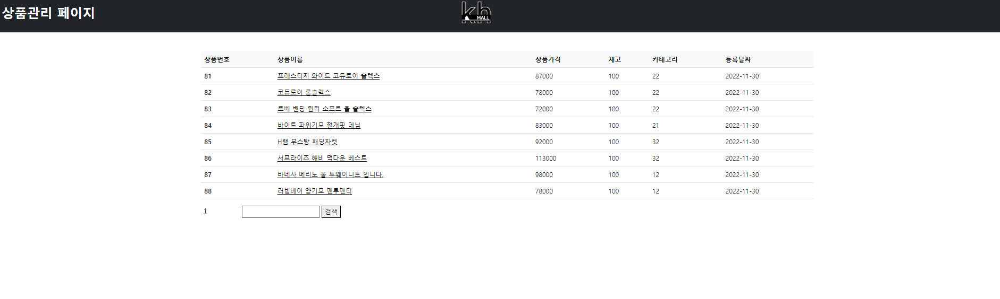
</p>
<p align="center">
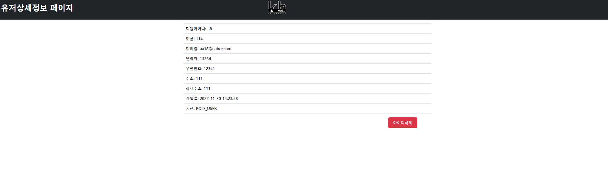
</p>
<p align="center">
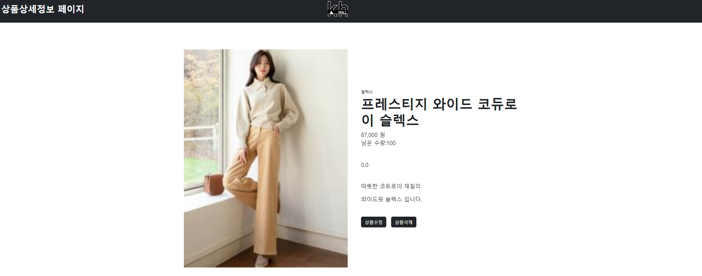
</p>


